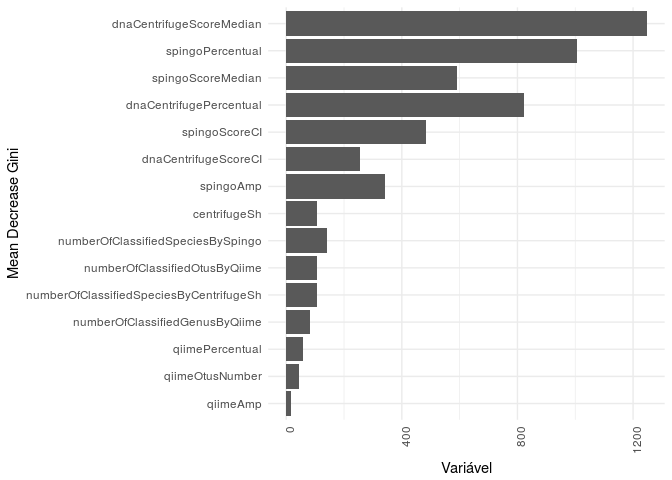
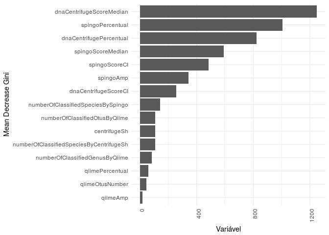
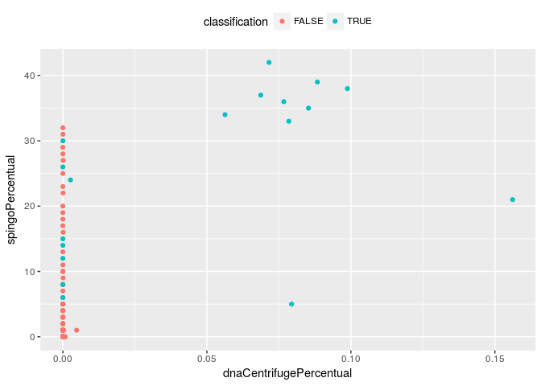
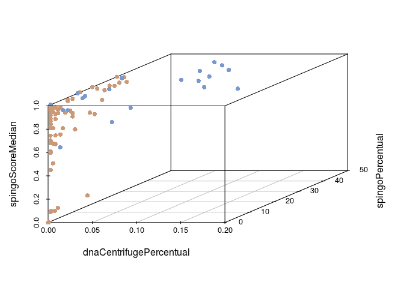
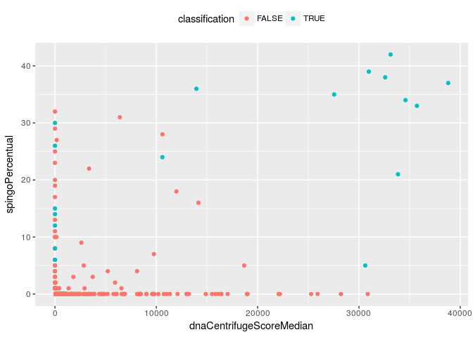
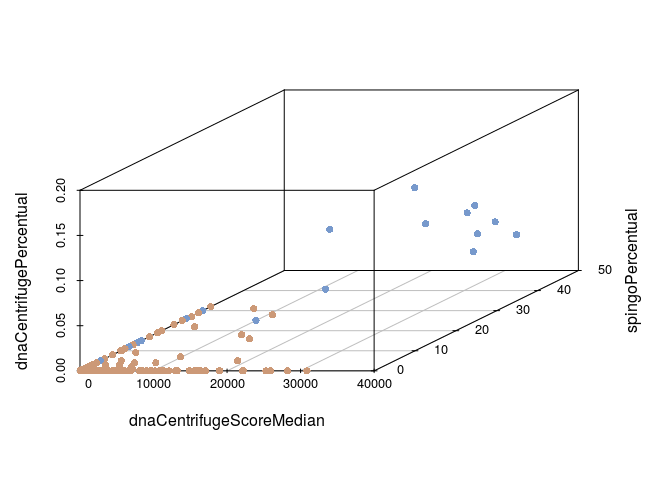

gunga: Centrifuge (Shotgun) + Spingo + QIIME
================
prata
Fri Aug 17 20:58:56 2018

``` r
knitr::opts_chunk$set(echo = TRUE)
```

Load necessary packages
-----------------------

``` r
require(magrittr)
```

    ## Loading required package: magrittr

``` r
require(dplyr)
```

    ## Loading required package: dplyr

    ## 
    ## Attaching package: 'dplyr'

    ## The following objects are masked from 'package:stats':
    ## 
    ##     filter, lag

    ## The following objects are masked from 'package:base':
    ## 
    ##     intersect, setdiff, setequal, union

``` r
require(stringr)
```

    ## Loading required package: stringr

``` r
require(taxdumpr)
```

    ## Loading required package: taxdumpr

``` r
require(gunga)
```

    ## Loading required package: gunga

``` r
require(randomForest)
```

    ## Loading required package: randomForest

    ## randomForest 4.6-12

    ## Type rfNews() to see new features/changes/bug fixes.

    ## 
    ## Attaching package: 'randomForest'

    ## The following object is masked from 'package:dplyr':
    ## 
    ##     combine

``` r
require(ggplot2)
```

    ## Loading required package: ggplot2

    ## 
    ## Attaching package: 'ggplot2'

    ## The following object is masked from 'package:randomForest':
    ## 
    ##     margin

``` r
require(scatterplot3d)
```

    ## Loading required package: scatterplot3d

``` r
require(caret)
```

    ## Loading required package: caret

    ## Loading required package: lattice

Instantiate the **Taxdumpr** base class
---------------------------------------

``` r
taxdumprObject <- Taxdumpr(nodesDmpLocation = "~/taxdump/nodes.dmp", namesDmpLocation = "~/taxdump/names.dmp")
```

Load the Centrifuge results
---------------------------

``` r
rawCentrifugeProfileDf <- loadRawCentrifugeProfile("data-raw/sh/centrifuge_report.tsv")
head(rawCentrifugeProfileDf)
```

    ##                  name taxID      taxRank genomeSize numReads
    ## 1                root     1      no rank          0     7599
    ## 2            Bacteria     2 superkingdom          0      726
    ## 3 Buchnera aphidicola     9      species     619958        7
    ## 4          Shewanella    22        genus    5140018        1
    ## 5  Archangium gephyra    48      species   12489432        1
    ## 6            Borrelia   138        genus    1145044        4
    ##   numUniqueReads abundance
    ## 1           7599         0
    ## 2            726         0
    ## 3              7         0
    ## 4              1         0
    ## 5              1         0
    ## 6              4         0

``` r
rawCentrifugeClassificationsDf <- loadRawCentrifugeClassifications("data-raw/sh/centrifuge_classifications.tsv")
head(rawCentrifugeClassificationsDf)
```

    ##           readID   seqID taxID score X2ndBestScore hitLength queryLength
    ## 1 SRR2081071.1.1 species  1590  7569             0       102         102
    ## 2 SRR2081071.2.1 species 28901 20509             0       227         250
    ## 3 SRR2081071.3.1 species 28901 16061             0       209         210
    ## 4 SRR2081071.4.1 species  1314 54756             0       249         249
    ## 5 SRR2081071.5.1 species  1590 35344             0       203         203
    ## 6 SRR2081071.6.1 species   818 54756             0       249         249
    ##   numMatches
    ## 1          1
    ## 2          1
    ## 3          1
    ## 4          1
    ## 5          1
    ## 6          1

``` r
centrifugeProfileForShotgunDf <- makeCentrifugeProfileForShotgun(rawCentrifugeProfileDf, rawCentrifugeClassificationsDf, taxdumprObject)
```

    ## Warning in if (rawCentrifugeProfileDf %>% is.na) {: a condição tem
    ## comprimento > 1 e somente o primeiro elemento será usado

    ## Warning in if (rawCentrifugeClassificationsDf %>% is.na) {: a condição tem
    ## comprimento > 1 e somente o primeiro elemento será usado

    ## Warning in is.na(.): is.na() aplicado a um objeto diferente de lista ou
    ## vetor de tipo 'S4'

``` r
head(centrifugeProfileForShotgunDf)
```

    ##   speciesId dnaCentrifugePercentual dnaCentrifugeScoreMedian
    ## 1         9            1.473263e-05                    100.0
    ## 2        14            1.152988e-05                    100.0
    ## 3        48            6.405489e-07                     64.0
    ## 4       104            1.281098e-06                    110.5
    ## 5       106            1.921647e-06                     64.0
    ## 6       139            1.281098e-06                     64.0
    ##   dnaCentrifugeScoreCI dnaCentrifugeHitLengthMedian
    ## 1            579.33641                         25.0
    ## 2             20.50459                         25.0
    ## 3                   NA                         23.0
    ## 4             20.57962                         25.5
    ## 5             11.10646                         23.0
    ## 6              0.00000                         23.0
    ##   dnaCentrifugeHitLengthCI dnaCentrifugeQueryLengthMedian
    ## 1                7.1433119                          174.0
    ## 2                0.9136886                          230.5
    ## 3                       NA                          119.0
    ## 4                0.9799820                          158.0
    ## 5                0.6533213                          216.0
    ## 6                0.0000000                          121.0
    ##   dnaCentrifugeQueryLengthCI dnaCentrifugeNumberOfMatchesMedian
    ## 1                   28.68631                                  1
    ## 2                   27.06185                                  1
    ## 3                         NA                                  1
    ## 4                  182.27665                                  1
    ## 5                  115.71167                                  1
    ## 6                   54.87899                                  1
    ##   dnaCentrifugeNumberOfMatchesCI centrifugeSh
    ## 1                              0         TRUE
    ## 2                              0         TRUE
    ## 3                             NA         TRUE
    ## 4                              0         TRUE
    ## 5                              0         TRUE
    ## 6                              0         TRUE

Load the Spingo results
-----------------------

``` r
spingoProfileDf <- makeSpingoProfileForAmplicon("data-raw/spingo/seqs.species.out",
                                                "data-raw/spingo/seqs.results.out",
                                                taxdumprObject)
head(spingoProfileDf)
```

    ##   speciesId spingoPercentual spingoScoreMedian spingoScoreCI spingoAmp
    ## 1    879566         0.000380             0.645    0.05606776      TRUE
    ## 2    187327         0.001140             0.970    0.04928126      TRUE
    ## 3    239935         0.011654             1.000    0.01749091      TRUE
    ## 4    214856         0.000127             0.735    0.06859874      TRUE
    ## 5    626932         0.000127             0.440    0.03339662      TRUE
    ## 6    265312         0.002534             0.790    0.02947289      TRUE

Load the QIIME results
----------------------

``` r
qiimeProfileDf <- makeQiimeProfileForAmplicon("data-raw/qiime/open_reference_otus/taxa_summary/otu_table_mc2_w_tax_L6.txt",
                                              "data-raw/qiime/open_reference_otus/uclust_assigned_taxonomy/rep_set_tax_assignments.txt",
                                              taxdumprObject)
head(qiimeProfileDf)
```

    ##   genusId qiimePercentual qiimeOtusNumber qiimeAmp
    ## 1     222    3.713317e-05               4     TRUE
    ## 2     237    2.560908e-06               1     TRUE
    ## 3     270    2.304817e-05               1     TRUE
    ## 4     286    2.240794e-04              14     TRUE
    ## 5     469    3.841362e-05               2     TRUE
    ## 6     544    4.865725e-05               3     TRUE

Merge profiles
--------------

``` r
integratedProfileDf <- mergeProfiles(centrifugeGungaProfileForSh = centrifugeProfileForShotgunDf, spingoGungaProfileDf = spingoProfileDf, qiimeGungaProfileDf = qiimeProfileDf, taxdumprObject = taxdumprObject)
head(integratedProfileDf)
```

    ##   genusId speciesId dnaCentrifugePercentual dnaCentrifugeScoreMedian
    ## 1      13        14            1.152988e-05                    100.0
    ## 2      13    513050            3.202745e-06                    100.0
    ## 3      22     60480            1.281098e-06                    110.5
    ## 4      22     60961            1.921647e-06                     64.0
    ## 5      22     62322            2.562196e-06                     64.0
    ## 6      22    271098            3.202745e-06                    100.0
    ##   dnaCentrifugeScoreCI dnaCentrifugeHitLengthMedian
    ## 1             20.50459                         25.0
    ## 2             28.97567                         25.0
    ## 3             20.57962                         25.5
    ## 4             11.10646                         23.0
    ## 5              0.00000                         23.0
    ## 6            131.56075                         25.0
    ##   dnaCentrifugeHitLengthCI dnaCentrifugeQueryLengthMedian
    ## 1                0.9136886                          230.5
    ## 2                1.4667027                          199.0
    ## 3                0.9799820                          174.0
    ## 4                0.6533213                          250.0
    ## 5                0.0000000                          178.5
    ## 6                4.6546566                          249.0
    ##   dnaCentrifugeQueryLengthCI dnaCentrifugeNumberOfMatchesMedian
    ## 1                   27.06185                                  1
    ## 2                   61.77650                                  1
    ## 3                   86.23842                                  1
    ## 4                   10.79464                                  1
    ## 5                   46.40450                                  1
    ## 6                   35.48239                                  1
    ##   dnaCentrifugeNumberOfMatchesCI centrifugeSh spingoPercentual
    ## 1                              0         TRUE                0
    ## 2                              0         TRUE                0
    ## 3                              0         TRUE                0
    ## 4                              0         TRUE                0
    ## 5                              0         TRUE                0
    ## 6                              0         TRUE                0
    ##   spingoScoreMedian spingoScoreCI spingoAmp phylumId qiimePercentual
    ## 1                 0             0     FALSE    68297               0
    ## 2                 0             0     FALSE    68297               0
    ## 3                 0             0     FALSE     1224               0
    ## 4                 0             0     FALSE     1224               0
    ## 5                 0             0     FALSE     1224               0
    ## 6                 0             0     FALSE     1224               0
    ##   qiimeOtusNumber qiimeAmp numberOfClassifiedSpeciesByAll
    ## 1               0    FALSE                       7.094235
    ## 2               0    FALSE                       7.094235
    ## 3               0    FALSE                       7.094235
    ## 4               0    FALSE                       7.094235
    ## 5               0    FALSE                       7.094235
    ## 6               0    FALSE                       7.094235
    ##   numberOfClassifiedSpeciesByCentrifugeSh
    ## 1                                7.052721
    ## 2                                7.052721
    ## 3                                7.052721
    ## 4                                7.052721
    ## 5                                7.052721
    ## 6                                7.052721
    ##   numberOfClassifiedSpeciesBySpingo numberOfClassifiedOtusByQiime
    ## 1                          4.465908                      7.183112
    ## 2                          4.465908                      7.183112
    ## 3                          4.465908                      7.183112
    ## 4                          4.465908                      7.183112
    ## 5                          4.465908                      7.183112
    ## 6                          4.465908                      7.183112
    ##   numberOfClassifiedGenusByQiime
    ## 1                       3.970292
    ## 2                       3.970292
    ## 3                       3.970292
    ## 4                       3.970292
    ## 5                       3.970292
    ## 6                       3.970292

Classify True and False Positives
---------------------------------

``` r
# rf.fit <- readRDS("data/CentrifugeSh_Spingo_Qiime_RF_ntree1000.rds")
# integratedProfilePredictions <- predict(rf.fit, integratedProfileDf)
# integratedProfileDf$classification <- integratedProfilePredictions == "TRUE"
integratedProfileDf <- clasifyCentrifugeShotgunSpingoAndQiimeGungaProfile(integratedProfileDf)
```

True and False Positivies classifications
-----------------------------------------

``` r
table(integratedProfileDf$classification)
```

    ## 
    ## FALSE  TRUE 
    ##  1185    20

Variable importance selection to plot
-------------------------------------

``` r
rf.fit <- readRDS("data/CentrifugeSh_Spingo_Qiime_RF_ntree1000.rds")
rfImportanceDf <- rf.fit$importance %>% data.frame
rfImportanceDf$variableName <- rf.fit$importance %>% data.frame %>% rownames
rfImportanceDf <- rfImportanceDf %>% arrange(desc(MeanDecreaseAccuracy))
```

Accuracy based:
---------------

``` r
rfImportanceDf$variableName <- factor(rfImportanceDf$variableName, levels = rfImportanceDf$variableName[order(rfImportanceDf$MeanDecreaseAccuracy)])
p <-
  rfImportanceDf %>%
  ggplot(aes(x = variableName, y = MeanDecreaseGini)) +
  geom_bar(stat='identity', position='dodge') +
  theme_minimal() +
  theme(axis.text.x = element_text(angle = 90, hjust = 1)) +
  xlab("Mean Decrease Gini") + ylab("Variável") +
  coord_flip()
p
```



Gini based:
-----------

``` r
rfImportanceDf$variableName <- factor(rfImportanceDf$variableName, levels = rfImportanceDf$variableName[order(rfImportanceDf$MeanDecreaseGini)])
p <-
  rfImportanceDf %>%
  ggplot(aes(x = variableName, y = MeanDecreaseGini)) +
  geom_bar(stat='identity', position='dodge') +
  theme_minimal() +
  theme(axis.text.x = element_text(angle = 90, hjust = 1)) +
  xlab("Mean Decrease Gini") + ylab("Variável") +
  coord_flip()
p
```



Basic plot with 2 main features according to random forest importante (Accuracy)
--------------------------------------------------------------------------------

``` r
integratedProfileDf %>%
  ggplot(aes(dnaCentrifugePercentual, spingoPercentual, color = classification)) +
  geom_point() +
  theme(legend.position = "top")
```



And with the 3 main features (Accuracy)
---------------------------------------

``` r
scatterplot3d(integratedProfileDf %>% select(dnaCentrifugePercentual, spingoPercentual, spingoScoreMedian),
              pch = 16,
              color= ifelse(integratedProfileDf$classification, "#7799cc", "#cc9977"))
```



Basic plot with 2 main features according to random forest importante (Gini)
----------------------------------------------------------------------------

``` r
integratedProfileDf %>%
  ggplot(aes(dnaCentrifugeScoreMedian, spingoPercentual, color = classification)) +
  geom_point() +
  theme(legend.position = "top")
```



And with the 3 main features (Gini)
-----------------------------------

``` r
scatterplot3d(integratedProfileDf %>% select(dnaCentrifugeScoreMedian, spingoPercentual, dnaCentrifugePercentual),
              pch = 16,
              color= ifelse(integratedProfileDf$classification, "#7799cc", "#cc9977"))
```



Performance evaluation
----------------------

Only beacuse we know the truth about our data - in general, users don't knkow.

``` r
truthSetCompleteTaxonomy <- read.delim("inst/extdata/truth_set_complete_taxonomies.tsv") %>% subset(datasetName == "Mix1")
integratedProfileDf$verification <- integratedProfileDf$speciesId %in% truthSetCompleteTaxonomy$speciesId
```

### RF:

``` r
integratedProfileDf %$% confusionMatrix(classification %>% factor, verification %>% factor)
```

    ## Confusion Matrix and Statistics
    ## 
    ##           Reference
    ## Prediction FALSE TRUE
    ##      FALSE  1184    1
    ##      TRUE     10   10
    ##                                           
    ##                Accuracy : 0.9909          
    ##                  95% CI : (0.9837, 0.9954)
    ##     No Information Rate : 0.9909          
    ##     P-Value [Acc > NIR] : 0.57927         
    ##                                           
    ##                   Kappa : 0.6409          
    ##  Mcnemar's Test P-Value : 0.01586         
    ##                                           
    ##             Sensitivity : 0.9916          
    ##             Specificity : 0.9091          
    ##          Pos Pred Value : 0.9992          
    ##          Neg Pred Value : 0.5000          
    ##              Prevalence : 0.9909          
    ##          Detection Rate : 0.9826          
    ##    Detection Prevalence : 0.9834          
    ##       Balanced Accuracy : 0.9504          
    ##                                           
    ##        'Positive' Class : FALSE           
    ## 

### Centrifuge:

``` r
integratedProfileDf %>% subset(centrifugeSh) %$% confusionMatrix(centrifugeSh %>% factor, verification %>% factor)
```

    ## Warning in confusionMatrix.default(centrifugeSh %>% factor, verification %>
    ## % : Levels are not in the same order for reference and data. Refactoring
    ## data to match.

    ## Confusion Matrix and Statistics
    ## 
    ##           Reference
    ## Prediction FALSE TRUE
    ##      FALSE     0    0
    ##      TRUE   1146   10
    ##                                           
    ##                Accuracy : 0.0087          
    ##                  95% CI : (0.0042, 0.0159)
    ##     No Information Rate : 0.9913          
    ##     P-Value [Acc > NIR] : 1               
    ##                                           
    ##                   Kappa : 0               
    ##  Mcnemar's Test P-Value : <2e-16          
    ##                                           
    ##             Sensitivity : 0.000000        
    ##             Specificity : 1.000000        
    ##          Pos Pred Value :      NaN        
    ##          Neg Pred Value : 0.008651        
    ##              Prevalence : 0.991349        
    ##          Detection Rate : 0.000000        
    ##    Detection Prevalence : 0.000000        
    ##       Balanced Accuracy : 0.500000        
    ##                                           
    ##        'Positive' Class : FALSE           
    ## 

### Spingo:

``` r
integratedProfileDf %>% subset(spingoAmp) %$% confusionMatrix(spingoAmp %>% factor, verification %>% factor)
```

    ## Warning in confusionMatrix.default(spingoAmp %>% factor, verification %>% :
    ## Levels are not in the same order for reference and data. Refactoring data
    ## to match.

    ## Confusion Matrix and Statistics
    ## 
    ##           Reference
    ## Prediction FALSE TRUE
    ##      FALSE     0    0
    ##      TRUE     77   10
    ##                                           
    ##                Accuracy : 0.1149          
    ##                  95% CI : (0.0565, 0.2012)
    ##     No Information Rate : 0.8851          
    ##     P-Value [Acc > NIR] : 1               
    ##                                           
    ##                   Kappa : 0               
    ##  Mcnemar's Test P-Value : <2e-16          
    ##                                           
    ##             Sensitivity : 0.0000          
    ##             Specificity : 1.0000          
    ##          Pos Pred Value :    NaN          
    ##          Neg Pred Value : 0.1149          
    ##              Prevalence : 0.8851          
    ##          Detection Rate : 0.0000          
    ##    Detection Prevalence : 0.0000          
    ##       Balanced Accuracy : 0.5000          
    ##                                           
    ##        'Positive' Class : FALSE           
    ## 

A shorter version for all
-------------------------

``` r
# integratedProfileDf <- gungaWorkflowForCentrifugeShotgunSpingoAndQiime("data-raw/sh/centrifuge_report.tsv", "data-raw/sh/centrifuge_classifications.tsv",
#                                                                        "data-raw/spingo/seqs.species.out", "data-raw/spingo/seqs.results.out",
#                                                                        "data-raw/qiime/open_reference_otus/taxa_summary/otu_table_mc2_w_tax_L6.txt",
#                                                                        "data-raw/qiime/open_reference_otus/uclust_assigned_taxonomy/rep_set_tax_assignments.txt",
#                                                                        "~/taxdump/nodes.dmp", "~/taxdump/names.dmp")
```
